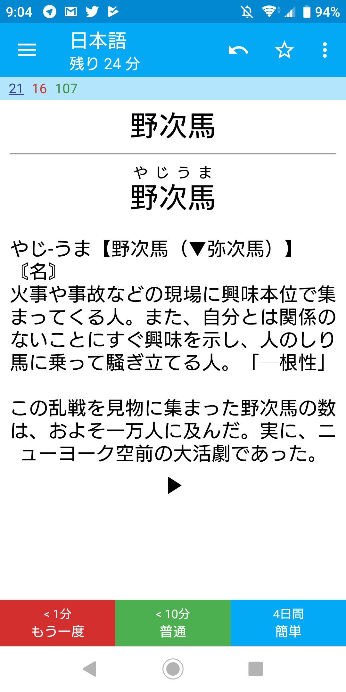
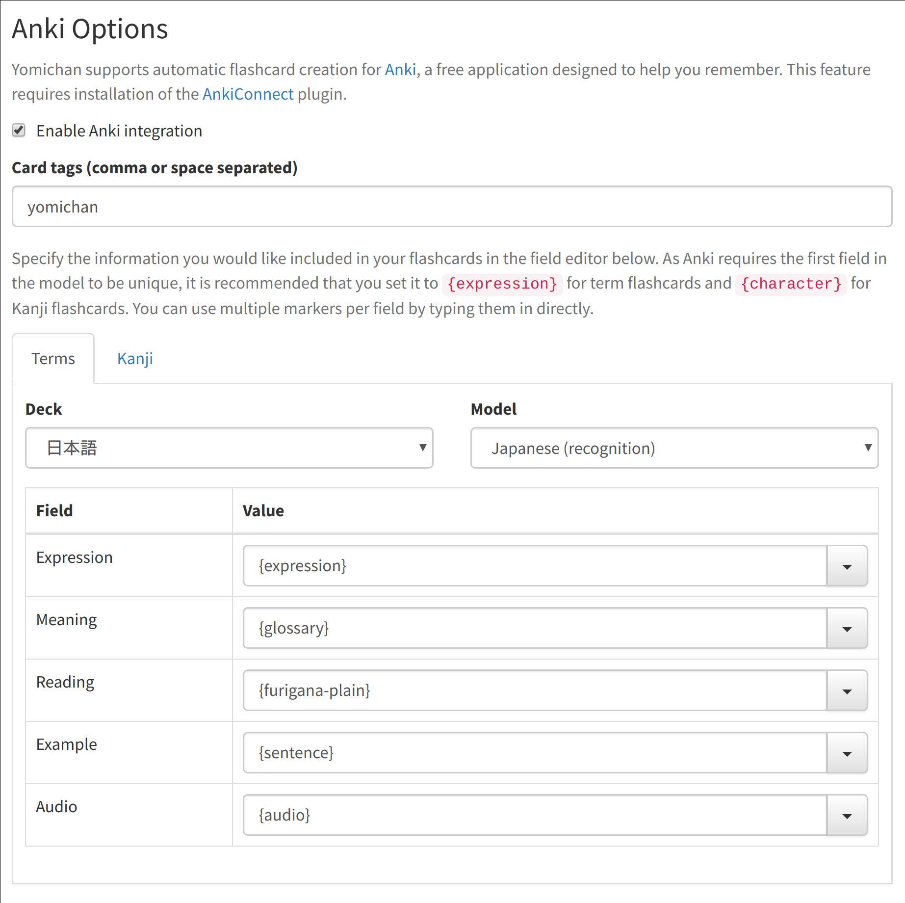

经过了两个多月的摸索使用，Anki 基本成为了我日常日语词汇记忆的重要一环，使用的流程和形态基本固定了下来，感觉可以分享给大家，如果有其他人也用得上的话。

## Anki 是？

熟悉日语的朋友可能意识到了，Anki 是「暗記」的读音。其实就是记忆的意思。它的核心理念非常简单，其实就是围绕**卡片**展开的，分为正面和反面。拿背单词来说的话，正面可以是单词本身，反面可以是对应的解释，读音等等，总之是让你回忆起来关于那个单词你需要记忆的要素。然后，对于这个单词，做出你对它熟悉程度的评价值。Anki 通过收集你对这些卡片的熟悉程度，决定在合适的时间再次出示这张卡片询问你对卡片的熟悉程度，以此来强化记忆，久而久之就会对需要记忆的单词越来越熟悉，因此再次出现的间隔也会越来越长，据说甚至最长会到数年。（我目前最长间隔的卡片大概是几个月之后会再次出现提醒下我。）总而言之 Anki 会为我们做的有：

- 生成用于记忆的卡片

- 收集我们对于每张卡片的记忆评价值

- 基于我们对卡片的熟悉程度安排每天的记忆任务

  <!--more-->

相对 Anki 为我们完成的事情，我们也有义务做一些事情。很显然，卡片不会凭空生成，需要我们提供。不过严格来说，我们提供的并不是卡片，而是类似**笔记**一样的东西。笔记是用来生成卡片的材料，这是一个非常优秀的理念，这比我们用纸和笔亲自做记忆卡片要高效和易于管理很多。拿我自己背日语单词来说的话，对于一个单词，我首先需要这个单词本身的数据（废话），其次是它的读音，释义，例句等。另外作为备注我们甚至希望记录它是在哪里被我们发现的。（如果是网页里看到的话，我们也许可以记录下出现这个单词的 URL，对于电子书的话，我们可以记录下出处的上下文）而这些一项一项数据，分别是一个个字段，他们一起组成了关于那个单词的笔记。我们需要定义一下这些字段的名字都叫啥，然后就可以愉快得做笔记了。（这是我们使用 Anki 最需要我们操心的部分）有了笔记，接下来我们定义一套规则，用来生成卡片。听起来好像很复杂，其实很简单，说白了就是，你需要在卡片的正面显示什么，背面显示什么，因为我们收集的笔记字段很多，但其实并不都需要放在卡片里，比如你收集了单词出处的链接，（一般来说）这个链接你当然不需要记住它。你把这个正反面的对应关系告诉 Anki，接下来就放心交给它，让它给我们生成我们用来记忆的卡片就行了。总的来说，我们需要插手做的就是：

- 做笔记，作为我们需要记忆的素材
- 指定笔记和卡片正反面的对应关系的规则，用于 Anki 生成记忆卡片。

另外，补充一下，既然是软件里的卡片不是纸片儿，我们当然可以记录图像、声音等等多媒体字段。

有了以上对于 Anki 的基础知识，基本就能使用这个软件了。接下来就是制定每天学习多少个新词呀，复习多少出现过的单词等等。（社会人的）我目前的话，每天新词上限 30 个，复习大概 150 个左右。一天耗时大概在 30 到 40 分钟。

## AnkiConnect + Yomichan = 最強

上面一波对 Anki 的简单分析过后，我们发现在使用 Anki 的过程中，几乎所有的时间分为两部分。一是添加新词（作笔记），而是回答 Anki 扔给我们的卡片。但是，我们的目的是记忆单词，而不是做笔记，所以如果作笔记的时间太长，相应地，我们用来记忆单词的时间就变少了，并且作笔记这件事情本身非常枯燥，非常消磨意志，另外谁也不能保证作笔记的过程中不出错。总之背单词（本来目的）之外枯燥的准备工作 +  自己可能出错的不安久而久之会造成对背单词这件事情额外的负担，渐渐得就会变得形骸化，这也是我之前基本坚持不了多久的原因我觉得。退一步想，如果在电脑上一字一句得录入单词，那和十几年前用纸和笔记录有什么区别呢？对于录入单词这一点儿，基本上有两个解决办法：

- 社区有很多其他玩家贡献的单词本，可以一键拿来用
- 自己想办法怎么最大限度的缩短收集新词的时间和手续

至于第一条，看起来似乎非常不错，但我非常不推荐这么做，我之前用过所有的单词软件都是这么起步的，但是也都没使用长久，原因我分析，别人的单词本记录的是别人想要记住的东西，我为啥非记住不可的抵触感 ，加上本身对别人笔记的来源和内容的不信任感导致觉得背（别人预设的）单词很痛苦。这种不信任感很容易导致放弃。而且，使用别人的单词本，天花板很明显，假设把所有单词背完了，迟早还是要走到自己制作单词本的路上来，与其如此，不如一开始就制作自己的单词本，单词的上限可以是无限。（理论上而言，实际上，我每天背 30 个新词，每天要收集 30 个自己不认识的新词也不是一件容易的事，而且会越来越难）

好在，自己制作单词本，并不需要真的一字一句自己输入，配置好之后，完全可以一键加入。这也是为什么说 Anki 强大的原因。得益于开源软件的优势，有很多人为它写插件，改善功能用法。其中就有 [AnkiConnect](https://foosoft.net/projects/anki-connect/) 和 [Yomichan](https://foosoft.net/projects/yomichan/) 这两个基本无敌的组合，感谢他们的作者，是同一个人。（感觉他一个人改变了整个日语 Anki 录入笔记的生态环境）

首先说 AnkiConnect，它是 Anki 的一个插件，主要用途是把对 Anki 的各种操作封装成了一套 RESTful 接口，方便其他程序通过 HTTP 通讯。一般读者如果不了解其中的细节，完全没有关系，总之就是联络 Anki 和其他程序的一套规则，有了这个我们就可以让其他程序把我们需要的笔记一键加入 Anki 了，这个「其他程序」这里简单地认为是浏览器就行了。当然了，浏览器本身不会带有一键添加生词本这样天马行空的功能，不过针对日语，Yomichan 这个浏览器插件有这样的功能，添加到 Anki 算是一个高级功能，本身这个插件可以用来查字典。它的最大优势是字典是本地字典，查询速度飞快。插件作者甚至制作了好几款日文字典文件的转换工具叫 [Yomichan Import](https://foosoft.net/projects/yomichan-import/)，通过转换，就可以把那些字典传到浏览器里，通过 Yomichan 来使用了。我目前爱用的字典有明镜国语辞典和三省堂大辞林。Yomichan 和 Anki 联动的最大的优势就是一键录入单词了，因为如果一个单词出现在浏览器里，我们是拥有所有关于这个单词的上下文，词义等等相关情报的。只是苦于没有手段一下子加到生词本里，而 Yomichan 就是把这个现场给保存下来的利器。这样，只需要点击一个按钮，就把你想要记住的单词记录到 Anki 中，不仅有权威字典的解释，有真人读音，还有看到这个词所在的文脉，如果需要还可以把文章链接放进去。而我们只要把宝贵的时间用来背单词就行了。（以下是配置示例和演示）

## 个人感想

尽管浏览器 + Anki 的组合已经能 Cover 大部分生词获取的来源了，但不得不说很多时候还是用移动设备比较多，比如看电子书，这方面的支持感觉目前还远不如桌面端那么方便。目前我在 Android 上使用了一个叫做 [Anki 划词助手](https://www.coolapk.com/apk/com.mmjang.ankihelper)的软件，不过对日文的支持不太友好，我自己写脚本生成了本地字典才勉强能用，这部分目前比较 Hack，而且需要一些编程知识才能解决，就不展开说了。有兴趣可以讨论。用法和 Yomichan 类似，使用截图就不单独贴了。

关于使用时间上的安排，我自己一般用早上起床之前的半个小时来背单词，本身这个时间是用来赖床用的，现在被挪用来背单词，感觉多少赚了一点儿。收集词汇的工作主要在睡前通过看小说啥的完成，有时候上班的时候看到生词就随手加一下，反正只要点一下鼠标而已。这里再贴个 Anki 生成的两个月来的使用报告，差不多录入了 1600+ 个词。

