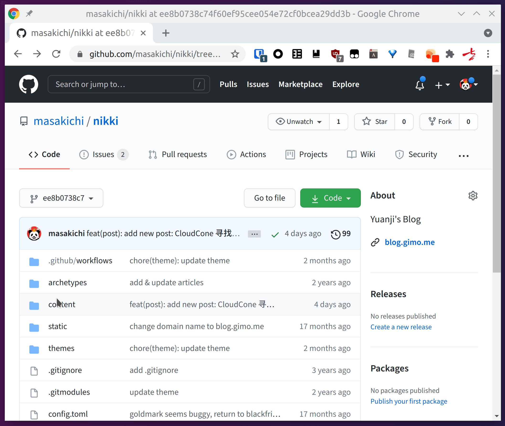

## 缘起

相信不少人跟我一样使用 GitHub 来托管博客的源文件，用 [Hugo](https://gohugo.io/) 来生成静态的 HTML 页面，然后用 GitHub Pages 也好其他什么服务也好来展示自己的博客，最终的成品就像你现在看到的这个网址是 blog.gimo.me 开头的页面。很少有读者会去关心这个博客背后的文件都存放在哪，不过作为这个博客的作者，时不时地还是会去它的 [GitHub 仓库地址](https://github.com/masakichi/nikki)看一看，一直以来有一个让人不爽的地方是这个 GitHub 仓库没有一个 README.md 文件，也就是说打开这个仓库的页面有种很突兀的感觉，什么介绍也没有，就像下面的 gif 里显示的那样。

<!--more-->



## 改造

但是，要在这个介绍里写点啥确实也让我犯了难，就想着不如在这个文件里列出所有文章的列表吧，就像这个博客的[归档页面](https://blog.gimo.me/post/)一样。当然手动去把每一篇的标题链接抠出来显然太麻烦了，而且每次要写新文章的时候还多出了这么一个新步骤显得有点得不偿失。于是问题就变成了如何自动地生成这个页面？实际上对 Hugo 的配置和主题稍加改造就能达成这个目的。通常我们用 Hugo 来生成的多数都是 HTML 文件，实际上它也能生成其他类型的文件，比如 RSS 的 xml 文件，同时也可以自己定义，这里我其实只要定义让它生成博客归档页面的 markdown 版本就可以了。

首先需要对主题的模板稍加改造，我的归档页实际上就是 /post 的主页，用 Hugo 的术语讲，这是一个 [section](https://gohugo.io/templates/section-templates/#page-kinds) 页面，对应的主题模板在 `layouts/_default/section.md`（因为我要生成 .md 结尾的文件，所以叫 section.**md**)

```go
# {{ .Site.Title }}

{{ T "archiveCounter" (len .Data.Pages) }}

{{- $posts := .Data.Pages.ByDate.Reverse }}
{{- range $index, $post := $posts }}
  {{- $thisYear := $post.Date.Format "2006" }}
  {{- $lastPost := $index | add -1 | index $posts }}
  {{- $postPath := replace $post.File.Path " " "%20" }}
  {{- if or (eq $index 0) ( ne ($lastPost.Date.Format "2006") $thisYear ) }}
## {{ $thisYear }}
  {{- end }}
- {{ $post.Date.Format "01-02" }} [{{ .Title }}](content/{{ $postPath }})
{{- end }}
```

主题支持了生成 md 文件还不够，还需要告诉 Hugo，让它每次生成的时候生成相应的 md 文件，基本的配置如下，无非是定义文件类型，需要哪些页面生成，这里在 section 的地方加入定义好的 MarkDown 即可。

```toml
[mediaTypes]                                                                                           
  [mediaTypes."text/plain"]                                                                            
    suffixes = ["md"]                                                                                  
                                                                                                       
[outputFormats.MarkDown]                                                                               
  mediaType = "text/plain"                                                                             
  isPlainText = true                                                                                   
  isHTML = false                                                                                       
                                                                                                       
[outputs]                                                                                              
  home = ["HTML", "RSS"]                                                                               
  page = ["HTML", "MarkDown"]                                                                          
  section = ["HTML", "RSS", "MarkDown"]                                                                
  taxonomy = ["HTML", "RSS"]                                                                           
  taxonomyTerm = ["HTML"]     
```

最后，加了一个简单的 Makefile，

```makefile
readme:
	hugo && cp public/post/index.md README.md
```

这样每次写完新的日记，执行一下 `make readme` 就可以直接生成最新的 README.md 文件了，是不是很方便呢？下面就是这一套操作之后的预览啦。


## 最后

所以，理论上不仅可以生成 md 文件，生成 JSON 甚至 EPUB 之类的应该也都不在话下，写好对应的生成逻辑就行。对于本文提到的生成 md 的方法包含在这个 [e33412b](https://github.com/masakichi/nikki/commit/e33412b7e76eaec9fa65f1bbc64e802a09f8ab10) commit 中，感兴趣的朋友可以参考。也欢迎到[本博客的源文件仓库](https://github.com/masakichi/nikki)看看。

