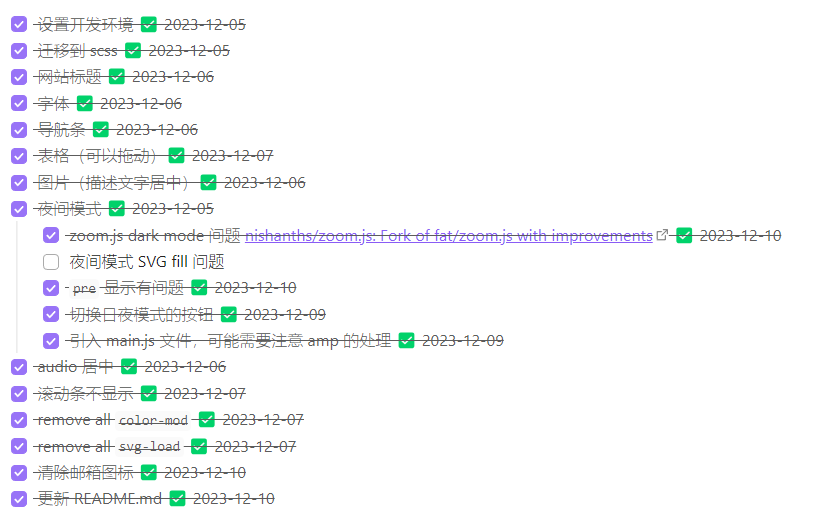

有的老读者可能注意到我的博客的样式似乎发生了一些变化。

没错，自上次重写主题以来，我的博客差不多有一年半没有太大样式上的变化了。如果有读者有读过我[上次那篇折腾博客主题的文章]()的话，应该知道我的主题主要基于一套 classless 的 CSS 样式，叫作 awsm.css。

然而最近当我想访问 awsm.css 的网站时，竟然发现原作者已经删库跑路了。虽然我有[自己的 fork](https://github.com/masakichi/awsm.css)，但作为一个契机，差不多是时候再折腾一下主题了，毕竟也临近年末了。

**从结论上而言，我从 awsm.css 转到了 [water.css](https://github.com/kognise/water.css)**

<!--more-->

## 经过

因为 water.css 也是一套 classless 主题，所以替换 awsm.css 并不是很费力，而且两套主题很相似，所以说实话如果没看出啥区别也不奇怪。不过就是一些小的细节花了几个晚上的业余时间微调了一下。简单列了一些问题点，大部分显著的毛病我已经修了，于是想着差不多可以释出第一版了。

其中一个值得注意的决定是，我尽量没有更改原主题的样式（除了少数 postcss 特有语法），额外的修改我都在主文件 `main.scss` 引入 water.css 的源文件之后加以覆盖，主要是为了以后如果上游有更新，可以比较容易地做相应更改。

## 改善点

我个人感觉用了 water.css 之后的一大改善点就是用上了 [CSS 自定义属性](https://developer.mozilla.org/en-US/docs/Web/CSS/Using_CSS_custom_properties)。一个直接的好处就是让支持夜间模式变得简单，这也是这次折腾主题的一个比较大的动力。虽然我自己基本从来不用夜间模式，但也许有喜欢我博客的读者使用，这一次重点支持了一下，如果对我的这次新改动的主题感兴趣，欢迎使用和反馈。（可以点击导航栏右侧的🌙/☀图案切换）

## 关于标题

一方面是因为这次样式的改变主要是因为选择了 <mark>water</mark>.css，另一方面也让我想起了李小龙之前在采访中关于“水”的一段谈话（见下面视频），借此就用作了我这篇短文的标题。

以上就是这周有关修改博客样式的介绍了，希望各位读者喜欢。

> Be formless, shapeless, like water.
>
> Now you put water into a cup, it becomes the cup,
> you put water into a bottle, it becomes the bottle,
> you put it in a teapot, it becomes the teapot.
>
> Now water can flow or it can crash.
>
> Be water, my friend.


