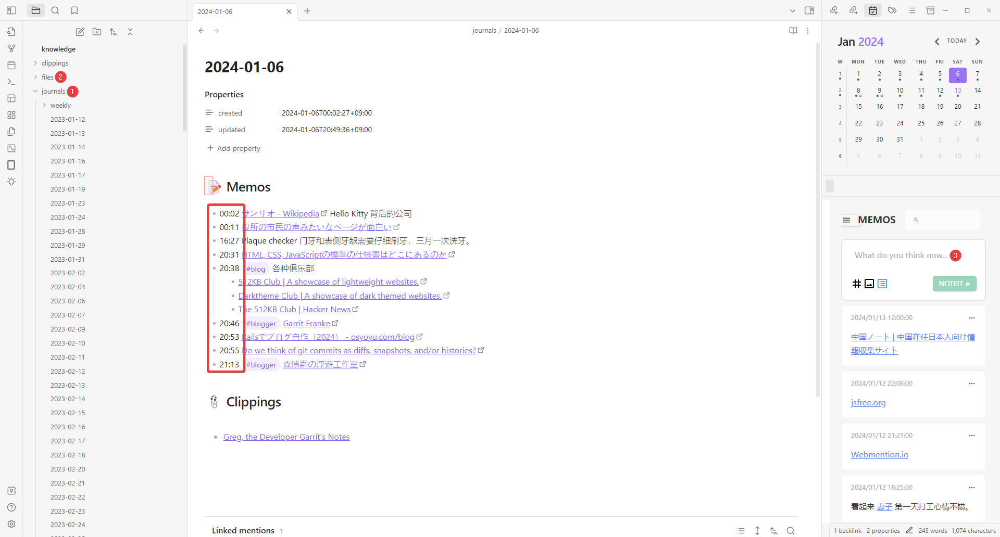

通过一整年使用 Obsidian，我已经熟练使用双链功能，为了研究 Zettelkasten、原子笔记等方法论甚至自学了德语，现在 Obsidian 俨然成为我的第二个大脑。

<!--more-->

当然这都是骗人的。实际的情况是我差不多才刚刚养成了记笔记（日记）的习惯而已。不过对比一年前的自己，或者更早前的自己，确实感觉在记录方面有了一些进步和心得。

## 之前做笔记的情况

首先，我想先介绍一下此前做笔记的情况。与其说做笔记的情况，不如说更像是换笔记软件的历史。

从十几年前陆陆续续尝试用软件记笔记开始，大大小小的软件、服务用过可能不下十个，但是记笔记也好写日记也好总是一时兴起记了几天，然后就没有然后了，记忆里没有哪次长期坚持下来。纵然有不少客观的原因（比如软件停止维护，服务终止之类），但还是主观原因居多。

- 第一个，清清白白的年轻人谁写日记啊？（暴论）一方面也许年轻时记忆力比较好，一方面可能那时候没意识有太大的记录必要性。
- 第二个，那个时候喜欢折腾，尤其是新事物，总觉得新的就是好的。举一些同时期干的类似事情，比如对使用的操作系统一不满意就干脆重新安装了；比如博客没怎么写几篇，时间都花在博客软件上了一样。等把系统配置地非常舒服了，却不知道该拿它去干嘛，或是等把博客系统折腾漂亮了，写博客的热情却没有了。
- 第三个，可能也是最重要的一个，**我压根不知道怎么记笔记。会使用笔记软件，跟会记笔记根本是两码事。** 举个简单的例子，办公软件基本谁都会用，可是做出来的资料是否赏心悦目，是否通俗易懂，靠的很多是软件之外的功力。

## 降低笔记的门槛

大体上，通过上面的几点分析，我首先花点时间研究其他人是都怎么记笔记，研究的过程中看到很多人、很多文章视频都推荐了 Obsidian，我差不多就从那时候随大流开始陆续使用直到现在。

就像文章开头讲到的，谈到 Obsidian 似乎就会提到双链，可能就会提到 Zettelkasten 及其衍生的方法论。我不否认，这些都是非常有用的知识，只是我感觉这些适合那些之前已经熟练做笔记、已经有很长笔记习惯的人。对于我来说，如果我一开始就花大量的时间研究怎么“完美”地记笔记，等我把这一套玩明白，我估计已经没有热情做笔记了（就像上面提到的折腾博客软件，操作系统的例子），又或者还没研究透就放弃了。所以对于我来说，**最重要地不是什么最佳记录方法，而是怎么鼓励自己养成记录的习惯。**

而对此，我得出的结论是，让自己像玩社交网络（比如发微博、发朋友圈一样）一样做笔记。

1. 不用思考标题或者说文件名（每天的日期就是文件名）
2. 不用思考照片、视频等附件放在哪里（所有文字记录之外的附属文件统统放到一个文件夹）
3. 不用思考文本格式，光标位置（不需要单独编辑中间的文本区域，在右侧直接“发推文”即可，然后正文就会自动加上时间戳）

当然了，目前的这个配置并非使用第一天就定型了，前两点差不多是初期就琢磨出来了，但是最后一点我觉得对于激发记录的欲望很有帮助，是我最近几个月才开始使用的。

## 保持简单

为了实现上面的功能其实主要靠下面两个插件即可，分别对应右侧上下两部分。

- [liamcain/obsidian-calendar-plugin: Simple calendar widget for Obsidian.](https://github.com/liamcain/obsidian-calendar-plugin)
- [Quorafind/Obsidian-Memos: A quick capture plugin for Obsidian, all data from your notes.](https://github.com/Quorafind/Obsidian-Memos)

另外，为了让本文的读者不要迷失在折腾笔记软件（尤其是插件）的不归路上，我斗胆建议以下几点：

- 使用默认皮肤（永远保持最好的兼容性，减少不必要的折腾）
- 尽可能少用插件（作为开始上述两个足够了）
- 积极配合其他软件（让一个软件只做它擅长的事情，比如安排日程、记账我都是用别的软件）

## 本文的目标读者

通过上述各种降低门槛的动作之后，现在我基本能及时地在无论是手机还是电脑上记录下自己的想法或者有意思的见闻了。本来打算写更多更仔细的教程，可是我想了想谁会是本文的目标读者呢？我假定的是像一年前一样的我这样的人，对于记笔记有兴趣又不得要领，在各种笔记软件间反复横跳的难民。如果我把各种笔记技巧写得头头是道，那读者去读市面上已经存在的比我写的精彩的文章就好了。

所以，故意地，本文只以日记为切入口，如果能让某个潜在读者读完本文后也想试一试尽可能多地去记录生活，记录有意思的瞬间，本文就功德无量了。再说，如果这篇文章反响不错，又或者我有了更多成熟的思考和心得，再写续篇不迟。

## 最后

总而言之，保持记录的习惯就是不要考虑太多，不要想着某个想法有没有价值，不要想太多自己的记录方法高不高效，只管记下来再说。对我而言可能经常就是写下几个词语，甚至直接上传一张照片。而通过上述配置后，Obsidian 能帮我安排好其他一切和记录本身无关的琐事。

最后，如果有读者对我上面这个极简的日记方式感兴趣，我直接做了个 [Obsidian Sample Vault](https://codeload.github.com/masakichi/obsidian-sample-vault/zip/refs/heads/main)，下载到本地,解压缩后用 Obsidian 打开即可使用。
