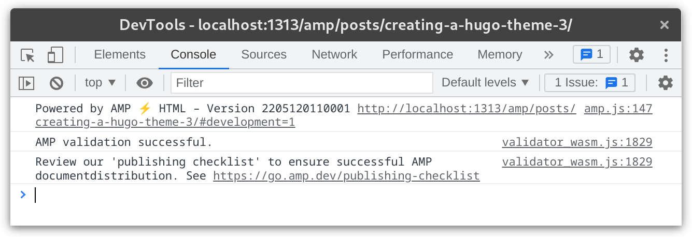

自从上周写了一篇关于[新博客主题的文章]()之后，这一周又陆续地改进了一些小地方，同时增加了一个新的主要功能，那就是给博客文章页面加上了 AMP 支持。

这篇文章就主要分享一下给 Hugo 主题适配 AMP 需要做哪些工作。



<!--more-->

## 什么是 AMP

AMP 是 Accelerated Mobile Pages 的简称，是由 Google 开发的一项加速移动设备访问的技术。目前从[AMP 的官网](https://amp.dev/)看，有 AMP Websites、Web Stories、AMP Emails 和 AMP Ads 四种，本文所描述的仅限 AMP Websites。

我当初知道这个技术主要是因为它有如下有点：

- 在 SEO（Search Engine Optimization，即搜索引擎优化）方面会有些优势
- 在移动端 Google 搜索结果中会展示一个闪电图标 <svg width="16px" height="16px" viewBox="0 0 88 88"><g stroke="none" stroke-width="1" fill="none" fill-rule="evenodd"><g fill="#999999"><path d="M44,0 C19.697,0 0,19.705 0,44 C0,68.303 19.697,88 44,88 C68.295,88 88,68.303 88,44 C88,19.705 68.295,0 44,0 L44,0 Z M40.348,77 L36.703,77 L40.333,51.333 L21.963,51.37 L47.718,11.007 L51.37,11.007 L47.659,36.681 L66,36.667 L40.348,77 Z"></path></g></g></svg>

然而在 2022 年现在，<mark>这些优点都已经不复存在</mark>。Google 不再把支持 AMP 与否作为 SEO 的一个因素，搜索结果的闪电图标也已经被移除。

## 为什么要支持 AMP

并没有什么特殊的理由，单纯只是因为实现起来并不太困难，同时也作为一个机会让 Hugo 可以生成不同格式的文档。而且经过上一次的优化，我的博客本身的载入速度已经飞快，所以实在要说理由的话，可能只是为了好玩。

## 如何适配

基本上就是以下几步：

- 阅读官方的[起步教程](https://amp.dev/documentation/guides-and-tutorials/start/create/basic_markup/)和[Hello World 例子](https://amp.dev/documentation/examples/introduction/hello_world/)，在 Hugo 主题下创建相应的模板文件。`layouts/_default/baseof.amp.html`
- 调试错误
- 当处理完所有报错后，会提示验证通过，然后会附上一个发布确认表的链接，再排查一下是否还有任何疏漏
- 最后就是重新编译部署博客了

### 模板文件

创建模板文件 `layouts/_default/baseof.amp.html` 大概像下面这个样子，一些无关的代码有所省略。

```go-html-template
<!DOCTYPE html>
<html ⚡ lang="{{ .Site.LanguageCode }}">
  <head>
    <meta charset="utf-8" />
    <script async src="https://cdn.ampproject.org/v0.js"></script>
    <meta name="viewport" content="width=device-width, initial-scale=1" />
    ...
    <link rel="canonical" href="{{ with  .OutputFormats.Get "html" -}}{{ .Permalink }}{{- end }}">
    {{ partial "schema_jsonld.html" . }}
    ...
    <style amp-boilerplate>...</style><noscript><style amp-boilerplate>...</style></noscript>
    <style amp-custom>
    {{ $main := resources.Get "scss/main.scss" | resources.ToCSS }}
    {{ $syntaxCss := resources.Get "css/syntax.css" }}
    {{ $inlineCss := slice $main $syntaxCss | resources.Concat "inline.css" | minify }}
    {{ replace $inlineCss.Content "@charset \"UTF-8\";" "" | safeCSS }}
    </style>
  </head>
  <body>
    <div id="amp-body">
      <header>{{- partial "header.html" . -}}</header>
      <main>
        ...
      </main>
      <footer>{{- partial "footer.html" . -}}</footer>
    </div>
  </body>
</html>
```

然后在 `config.toml` 里开启生成 AMP 文件的选项。

```toml
[outputs]
  home = ["HTML", "RSS"]
  page = ["HTML", "AMP", "Markdown"]
```

这样生成的 AMP 文件就会位于 `/amp/posts/` 之下了，比如本文的 AMP 版本即 👉[/amp/posts/creating-a-hugo-theme-3/](/amp/posts/creating-a-hugo-theme-3/)

主要的一些注意点是：

- 首先需要在 `html` 标签中插入一个 ⚡ 图标，当然直接写 `amp` 三个字母也可以
- 然后 `head` 的第一个子元素需要声明字符集，第二个子元素必须引入 AMP 的库文件
- 在 `head` 里声明一个 canonical 链接指向普通的网页页面，如果网站只提供 AMP 版本则链向自己
- 原封不动复制 [AMP Boilerplate Code](https://amp.dev/documentation/guides-and-tutorials/learn/spec/amp-boilerplate/)
- **不允许引入外部脚本文件** （比如需要禁用 Disqus）
- **不允许引入外部样式文件** （只能在 AMP 本页面定义样式）

除了这些显示的注意点，还有一些隐形的“坑”：

- 不允许使用 `!important`，然而 AMP 它自己自带的样式却对 `body` 标签使用了，这很无语。（为此我只能把我原有直接放在 `body` 下的元素用一个 `div` 包一下）
- 默认运行 `hugo server` 会自动在网页中植入 `livereload.js` 来实现自动刷新网页的功能，这会打破 AMP 页面不能引入外部脚本的规则，关闭 hugo 的自动刷新可以使用 `hugo server --disableLiveReload`

### 调试工具

打开 Chrome 的开发者工具，在 URL 后加上 `#development=1`，可以在 `Console` 标签卡中查看所有页面中的错误。同时也可以使用 [The AMP Validator](https://validator.ampproject.org/) 这个在线检测工具。




### 图片处理

基本上通过如上步骤就能完成所有适配了，不过除此之外，官方还有一些推荐项目，图片正是其中之一。普通 HTML 里的图片用 `` 标签，在 AMP 里推荐使用 `<amp-img></amp-img>`，于是创建一个 `layouts/_default/_markup/render-image.amp.html`，内容可以直接看[这里的代码](https://github.com/yuanji-dev/futu/commit/f35ef557418d9cda179f0bbad14b14f842c919a1#diff-b0e53042d9a5d639a5efa85e987b31965c541c73516332373980b3a4065b0992)。

### JSON-LD

另外一个值得推荐的是在 HTML 里嵌入结构化的 schema 信息，JSON-LD 则是用来描述这样信息的一种格式，具体来说就是插入像是下面这样的 JSON 内容，这个不仅 AMP 适用，普通的网页也都适用，像是新闻网站，论坛类的网站这个用的还挺广泛的。更多信息可以查看：[Schema.org - Schema.org](https://schema.org/)

```html
<script type="application/ld+json">
  {
    "@context": "http://schema.org",
    "@type": "BlogPosting",
    "headline": "动手写一个Hugo博客主题（AMP篇）",
    "url": "https://blog.gimo.me/posts/creating-a-hugo-theme-3/",
    "image": "http://blog.gimo.me/cover.png",
    "description": "...",
    "keywords": ["Hugo", "AMP", "博客", "主题"],
    "articleBody": "...",
    "articleSection": "posts",
    "wordCount": 2000,
    "author": {
      "@type": "Person",
      "url": "https://blog.gimo.me",
      "name": "Yuanji"
    },
    "datePublished": "2022-05-28T20:50:29+09:00",
    "dateModified": "2022-05-28T20:50:29+09:00",
    "inLanguage": "zh-CN"
  }
</script>
```

另外对于 Schema 是否格式正确可以在 [Schema Markup Testing Tool | Google Search Central  |  Google Developers](https://developers.google.com/search/docs/advanced/structured-data) 验证。

### 其他

做完以上差不多就可以上线了，但是上线后我用在线工具一检测发现，有一个错误提示引用了一个外部的脚本文件，原来是 Cloudflare 的 Web Analytics 的脚本文件，如果你也用 Cloudflare Pages 部署并开启了这个功能的话，它会在所有 HTML 文档中加入这个脚本，为此我还要在 Pages 里禁用 Web Analytics 功能，然后到 Web Analytics 里手动创建一个新站点，再[修改 Hugo 的模板文件](https://github.com/yuanji-dev/futu/commit/fd064478fcdb8df6ad3750b3c305962eca2fc8ba)让脚本只在非 AMP 页面启用，这样一来就可以顺利通过验证了。

## 感想

经过这次的折腾，感觉对于 Hugo 的 [Custom Output Formats](https://gohugo.io/templates/output-formats/) 功能有了更深入的认识，再感受这个功能灵活的同时，也感觉它目前有局限的地方，比如对于 Hugo 的 Page 来说，虽然它提供了 `AlternativeOutputFormats` 和 `OutputFormats` 两个属性，却没有一个方式知道当前的 Page 到底是哪种，只能通过两者去掉交集的方式来变通一下。不过也因此知道了 `partial` 不仅可以作为复用模板的工具，也可以用来[返回自定义的变量](https://github.com/yuanji-dev/futu/commit/736e65d28b8c0fedb0717074d233b83a500a6b0b#diff-0a85521ce8cea9a94875c70b75fee6d50f2faf8f42b55d3c091afffe61e2369f)。

另一方面对于 SEO 有了更多的认识，总的来说就是如何更好地把网站数据更为结构化地让搜索引擎能够读懂。很多新闻网站都是很好的例子，比如 NHK 的新闻就有很好的文档结构，也支持 AMP，从学习这些网站的构造还了解到不少 `head` 里标签的作用。

总之以上就是这次折腾的经过了，AMP 本身也许已经过时，但是让网页、文档如何保持条理便于理解则可以持续优化下去。
